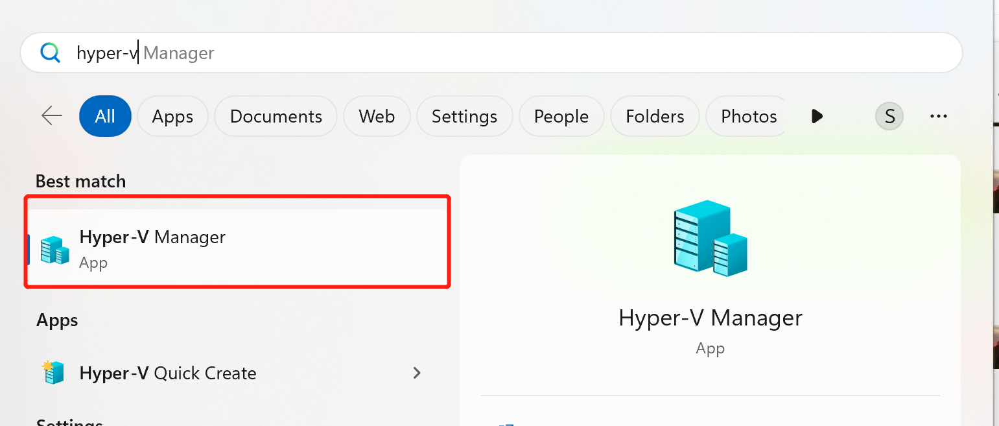

# WSL 如何使用桥接模式链接网络

## 安装Hyper-V组件

安装hyper-v组件，进入设置 -> APP


## 设置虚拟交换机WSL
### 打开查找命令窗

### 查找hyper-v

### 打开Hyper-V 在界面中点击action菜单， 选择connect server

### 设置名称为WSL的虚拟交换机

链接本地服务器后,进入action菜单，选择virtual switch manager菜单，弹出窗中，剪辑1，2，创建新的虚拟交换机
### 设置虚拟交换机名称和网络接口

### 在用户目录下常见.wslconfig文件，如下内容

## 验证
```
wsl
ifconfig
```


